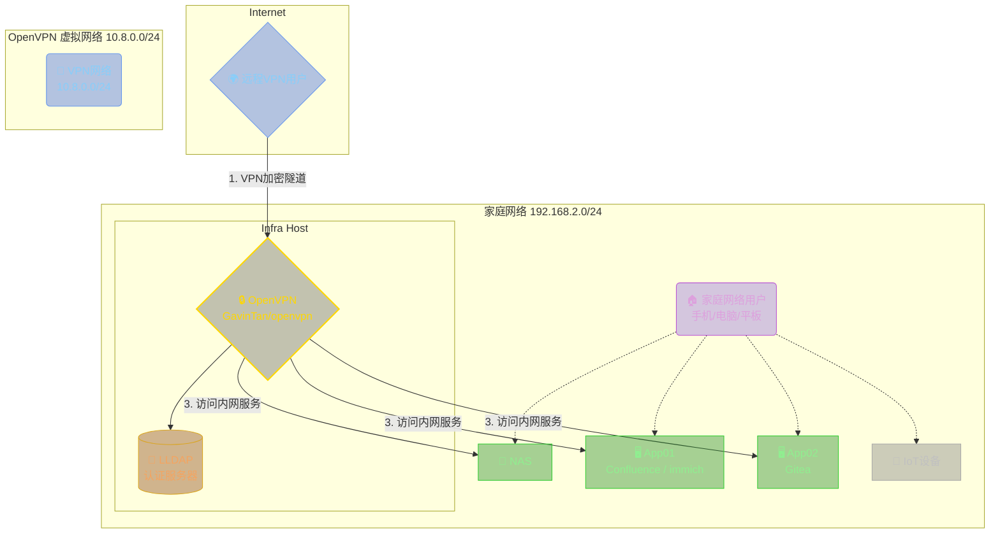

原本路由器上的 `Openwrt` 已经自带了 `OpenVPN Server`，但是最近有需要开多账号给同事来访问家里的服务器资源，索性就稍稍改造一下，让 `OpenVPN` 支持多用户登录，顺便结合上一篇 [HomeLab 系列 - 认证(上)](https://blog.skyhive.tech/post/cb650389.html) 用 LLDAP 管理用户。

<!--more-->

## 选型

[OpenVPN](https://github.com/OpenVPN/openvpn) 是一个老牌的开源 VPN 系统了，中心化的网络要求你必须得有一个公网 IP 地址，如果没有 IP 地址的可以尝试使用 [Zerotier](https://www.zerotier.com/) 这种解决方案。

那么言归正传，`OpenVPN` 和 `OpenVPN-AS(Access Server)` 的部署在网上有很多，简单说下区别：

| 特性           | OpenVPN (社区版)                                           | OpenVPN Access Server (企业版)                                             |
| :------------- | :--------------------------------------------------------- | :------------------------------------------------------------------------- |
| **核心性质**   | 开源的底层协议和软件                                       | 基于开源核心的商业产品                                                     |
| **授权模式**   | 完全免费                                                   | **按并发连接数收费**，提供免费2个连接                                      |
| **安装配置**   | **复杂**：手动编辑配置文件、管理证书、设置路由和防火墙。   | **极简**：基于Web的图形化界面，几分钟内即可完成部署。                      |
| **用户管理**   | 手动为每个用户生成证书和配置文件。                         | 内置用户管理系统，支持本地用户、数据库（LDAP/AD）集成。                    |
| **管理方式**   | 命令行 + 文本编辑器                                        | 强大的Web管理后台和用户门户                                                |
| **功能和生态** | 核心VPN功能，高度灵活，依赖社区插件。                      | **开箱即用**：内置负载均衡、日志审计、双因子认证、会话监控、客户端分发等。 |
| **支持**       | 社区论坛、邮件列表                                         | 官方的技术支持和维护服务                                                   |
| **适合场景**   | 技术人员、爱好者、有特定自定义需求的企业、成本敏感的项目。 | 寻求快速部署、易用性、集中管理和企业级功能的中小企业至大型企业。           |

当然 `OepnVPN-AS` 在网上也有很多不要钱的方案，大家可以自行搜寻（但不鼓励），而 `OpenVPN` 本身也带有 auth 的功能，如果运用得当，在家庭环境下使用也是绰绰有余了。那么有没有一个可以集成 LDAP、自带 WebUI、还能对客户端/配置进行管理的开源项目呢？有的，兄弟，有的：[GavinTan/openvpn](https://github.com/GavinTan/openvpn)，我只能说天底下还是好人多啊

这是个国人开源的项目，目前支持如下功能：

- 账号管理
- 证书管理
- `IPv6` 支持
- `LDAP` 支持
- `MFA` 支持
- 连接历史记录
- VPN 账号固定 IP
- 在线编辑 `server.conf`
- 在线重启 `OpenVPN` 服务
- 一键生成客户端 & `CCD` 配置文件

## 部署

详细安装文档请参考项目本身 [README](https://github.com/GavinTan/openvpn)，这里仅讨论我家里环境所需要的配置。现在开始分析一下架构和需求：

- 需要使用 LDAP 管理用户，那么直接使用上篇文章部署好的 [LLDAP](https://blog.skyhive.tech/post/cb650389.html)
- 需要部署在 Docker 中，并且客户端可以访问家里的网络环境

简单画一下架构图



那么下面开始部署：

```yaml
services:
  openvpn:
    image: yyxx/openvpn
    cap_add:
      - NET_ADMIN
    ports:
      - "1194:1194"
      - "8833:8833" # Web UI 端口
    environment:
      - TZ=Asia/Shanghai
      - ADMIN_USERNAME=admin
      - ADMIN_PASSWORD=<ADMIN_PASSWORD>
      - OVPN_PROTO=tcp
      - OVPN_GATEWAY=false
      - OVPN_LDAP_AUTH=true
      - ENV_UPDATE_CONFIG=false
      - LDAP_URL=ldap://<INTERNAL_IP>:3890
      - LDAP_BASE_DN=ou=people,dc=skyhive,dc=com
      - LDAP_BIND_USER_DN=UID=lldap,ou=people,dc=skyhive,dc=com
      - LDAP_BIND_PASSWORD=*********
      - LDAP_USER_GROUP_DN=cn=openvpn,ou=groups,dc=skyhive,dc=com
    volumes:
      - ./data:/data
      - /etc/localtime:/etc/localtime:ro
    networks:
      openvpn_net:
        ipv4_address: 192.168.200.2

networks:
  openvpn_net:
    driver: bridge
    ipam:
      config:
        - subnet: 192.168.200.0/24
          gateway: 192.168.200.1
```

这里有几点需要注意：

1. 家庭网络使用 `UDP` 作为 VPN 的连接容易出问题，因此我这里改成了 TCP
2. 由于我需要修改 `server.conf`，因此将 `ENV_UPDATE_CONFIG` 配置为 false
3. `LLDAP` 中创建的 group 都在 `ou=groups` 下
4. 我特地将 `OpenVPN Server` 的容器网络固定在了 `192.168.200.0/24`，是为了方便后续配置其他东西
5. 默认的 VPN 网络为 `10.8.0.0/24`

```shell
## 先开启 openvpn 所在主机的路由转发
sudo -i

echo 'net.ipv4.ip_forward=1' >> /etc/sysctl.conf

sysctl -p

## 配置 iptables

# ⚠️ 将 eth0 替换为宿主机实际的 LAN 网卡名称！
sudo iptables -t nat -A POSTROUTING -s 10.8.0.0/24 -o eth0 -j MASQUERADE

# 允许来自 VPN 子网的流量被转发
sudo iptables -A FORWARD -s 10.8.0.0/24 -j ACCEPT

# 允许目标是 VPN 子网的流量被转发 (用于 LAN 设备访问 VPN 客户端)
sudo iptables -A FORWARD -d 10.8.0.0/24 -j ACCEPT
```

由于我们需要将 VPN 的网络(`10.8.0.0/24`)流量路由到家庭网络(`192.168.2.0`)，因此需要在 `server.conf` 中增加一条路由推送的配置 `push "route 192.168.2.0 255.255.255.0"`。

至此，我们的部署就完成了。

## 配置

根据我们前面部署的配置，Web UI 的端口是 `8833`，通过浏览器访问登陆后，我们就可以开始进行配置了

首先需要新增一条客户端配置，右上角 `管理 --> 客户端` 进入客户端列表


点击右上角的 `添加` 按钮，开始添加配置


这里需要说明一下：

- VPNServer：这里需要填写你外网 IP / 域名和端口，因为你最终是需要从公网连过来的
- CCD 配置这里你可以配置 `ifconfig-push` 来固定客户端的 IP 地址，其他配置可以去查询文档自行决定
- 自定义配置可以添加 `route <network> <netmask>`，其他配置可以去查询文档自行决定

客户端配置添加完成后，我们在去添加账号和配置的映射关系，右上角 `管理 --> VPN 账号` 进入账号列表


_注意，右下角有提示：已启用 LDAP 认证，本地 VPN 账号将不再工作！_ 这里指的是添加后的账号认证由 `LDAP` 接管，本地不再进行认证，仅实现认证后的 VPN 配置匹配。

点击右上角 `添加` 按钮，开始添加账号


_注意：_

- 用户名：由于我们对接了 LDAP，这里要填写域账号（并且如果配置了 `LDAP_USER_GROUP_DN` 则需要填写该组中的用户）
- 密码：密码随便填，不生效的
- IP 地址：理论上可以固定 IP 地址，但是我测试过不生效，最后通过配置文件中 `ifconfig-push` 来实现固定了

至此，我们的配置就已经全部完成，现在使用配置好的域账号登录 Web 页面，可以看到如下界面：


可以在此处下载配置文件和客户端，进行客户端的连接，另外如果配置启用了 MFA，则可以在此处对 MFA 进行配置。
