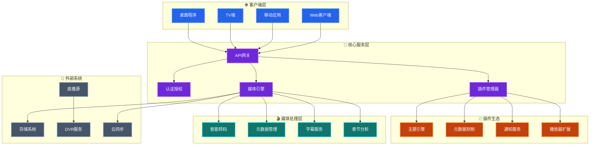

其实每一个折腾 `HomeLab` 的兄弟或多或少都离不开这两个词 -- `NAS`、`家庭影音`，为此也诞生出很多优秀的开源软件，比如 `Plex`、`Emby`、[`Jellyfin`](https://jellyfin.org) 等等。经过多年的调教与折腾，`Jellyfin` 这套方案也愈发成熟，这里简单记录一下部署过程和一些常用配置

<!--more-->

话不多说，先来看看 `Jellyfin` 的架构图（该架构图由 AI 生成）

从图中可以看到 `Jellyfin` 的工作流程以及功能很简单：

1. **全平台客户端**：Web/手机/TV/桌面，进度云端同步
2. **实时硬件转码**：NVENC/QSV/VAAPI，带宽自适应
3. **自动媒体整理**：TMDB 元数据 + 章节点生成，一键刮削海报与字幕
4. **多用户家庭共享**：分级权限、家长控制、离线缓存
5. **插件扩展**：主题、通知、第三方元数据，热插拔即装即用
6. **开源免订阅**：本地部署，数据归自己，永无会员墙
