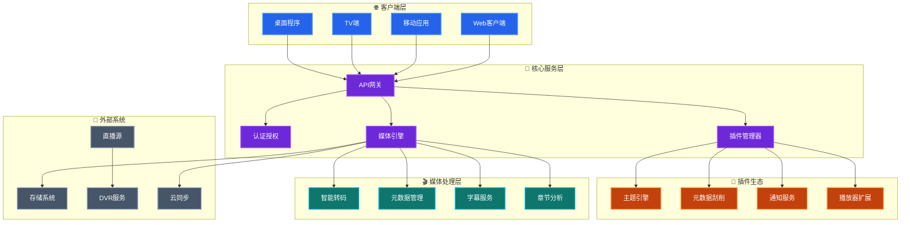

其实每一个折腾 `HomeLab` 的兄弟或多或少都离不开这两个词 -- `NAS` 和 `家庭影音`，为此也诞生出很多优秀的开源软件，比如 [`Emby`](https://emby.media)、[`Jellyfin`](https://jellyfin.org) 等等。经过多年的调教与折腾，`Jellyfin` 这套方案也愈发成熟，这里简单记录一下部署过程和一些常用配置

<!--more-->

话不多说，先来看看 `Jellyfin` 的架构图（该架构图由 AI 生成）



从图中可以看到 `Jellyfin` 的功能特点总结为如下几点：

1. **全平台客户端**：Web/手机/TV/桌面，进度云端同步
2. **实时硬件转码**：NVENC/QSV/VAAPI，带宽自适应
3. **自动媒体整理**：TMDB 元数据 + 章节点生成，一键刮削海报与字幕
4. **多用户家庭共享**：分级权限、家长控制、离线缓存
5. **插件扩展**：主题、通知、第三方元数据，热插拔即装即用
6. **开源**：本地部署，无数据泄露风险，无需付费

### 部署

详细的安装部署可以参考 [Jellyfin 官方文档](https://jellyfin.org/docs/general/installation/)，`Jellyfin` 支持多种操作系统和多种部署方式，由于笔者使用 Docker 部署，这里仅记录 Docker 的部署方式。`docker-compose.yaml` 参考如下：

```yaml
services:
  jellyfin:
    image: jellyfin/jellyfin:10.11.5
    container_name: jellyfin
    restart: unless-stopped
    environment:
      - TZ=Asia/Shanghai
      - JELLYFIN_PublishedServerUrl=http://<你宿主机 IP 地址>
    ports:
      - "8096:8096/tcp"
      - "7359:7359/udp"
    volumes:
      - /volume1/mnt/data/jellyfin/config:/config
      - /volume1/mnt/data/jellyfin/cache:/cache
      # 这里挂载你的媒体文件目录
      - /volume1/Documentary:/media/documentary:ro
      - /volume1/Movie:/media/movie:ro
      - /volume1/Series:/media/series:ro
      - /volume1/Villa:/media/villa:ro
    # 硬件加速
    # devices:
    #   - /dev/dri:/dev/dri
```

### 配置

详细的配置文档可以参考 [Jellyfin Post-Install Setup](https://jellyfin.org/docs/general/post-install/setup-wizard/) 和 [Jellyfin Administration Configuration](https://jellyfin.org/docs/general/administration/configuration)，这里仅记录一些常用的配置。

#### 面子工程

开源产品的功能固然重要，但是面子也很重要，难用的不要，丑出天际的也不能要。不过 `Jellyfin` 本身的 UI 设计就不算丑，在此基础之上还提供了两个方案：

- [自定义 CSS](https://jellyfin.org/docs/general/clients/css-customization/)
- [插件](https://jellyfin.org/docs/general/server/plugins/)：这里推荐一个用的比较多的插件 -- [Skin Maanger](https://github.com/danieladov/jellyfin-plugin-skin-manager)

我个人目前使用的是自定义 `CSS` 的方式，轻量且简单，使用别人写好的 `CSS` 都不需要做什么额外的配置，可参考下方配置

```css
@import url("https://cdn.jsdelivr.net/gh/lscambo13/ElegantFin@main/Theme/ElegantFin-jellyfin-theme-build-latest-minified.css");
```

除了对界面进行美化之外，还有个插件可以在主页 `Banner` 实现随机推荐，效果也是一级棒。感兴趣的可以移步 [Media Bar](https://github.com/IAmParadox27/jellyfin-plugin-media-bar)，这个项目是从 [Jellyfin-Media-Bar](https://github.com/MakD/Jellyfin-Media-Bar) Fork 二开而来，配置简单，只需要如下几步即可：

1. 将 `https://www.iamparadox.dev/jellyfin/plugins/manifest.json` 添加至 Plugin Repository
2. 安装 `Media Bar` 和 `File Transformation` 两个插件（注意，`Jellyfin` 的版本要求在 `10.10.7` 以上）
3. 重启 `Jellyfin` 服务

这这时你就能够在首页看到自定义的 `CSS` 和 `Media Bar` 的效果了

下面放两张图给大家看看效果


#### 媒体库配置

按照我个人的习惯，将媒体库分成了四个部分 -- `电影`、`电视剧`、`纪录片`、`九公斤`，分别对应 `Movie`、`Series`、`Documentary`、`Villa` 四个挂载进来的目录，其实你大可以将 `纪录片` 和 `电视剧` 合并在一个目录里，由于我在存储的时候就已经分开，这里我也分开配置了。

媒体库的基础配置如下：

- 首选下载语言：`Chinese`
- 国家/地区：`People's Republic of China`
- 优先使用内置的标题而不是文件名：**开启**
- 启用实时监控：**开启**
- 自动添加到合集：**开启**
- 自动从互联网获取元数据并刷新：**每 30 天**
- 元数据存储方式：**NFO**
- 将媒体图像保存到媒体所在文件夹：**开启**
- 保存字幕到媒体所在文件夹：**开启**

除此之外，还需要额外再配置两个插件来完成 **刮削** 和 **字幕下载** 的功能

- [Metashark](https://github.com/cxfksword/jellyfin-plugin-metashark)
- [MeiamSubtitles](https://github.com/91270/MeiamSubtitles)

先说两个插件的安装：

1. Step1：分别在 Plugin Repository 添加如下地址：
   - `https://ghfast.top/https://github.com/cxfksword/jellyfin-plugin-metashark/releases/download/manifest/manifest_cn.json`（国内加速地址） 或者 `https://github.com/cxfksword/jellyfin-plugin-metashark/releases/download/manifest/manifest.json`（国外地址）
   - `https://github.com/91270/MeiamSubtitles.Release/raw/main/Plugin/manifest-stable.json`
2. Step2：安装插件 -- `MetaShark`、`MeiamSub.Thunder` 和 `MeiamSub.Shooter`
3. Step3：重启 `Jellyfin` 服务

在媒体库中的配置就可以加入这两个插件相关的配置了：

- 字幕下载器勾选：`MeiamSub.Thunder`、`MeiamSub.Shooter`
- 元数据下载器和图片获取器勾选：`MetaShark`

#### 转码配置

`Jellyfin` 支持多种解码方式，具体可参考 [Jellyfin Transcoding](https://jellyfin.org/docs/general/post-install/transcoding/hardware-acceleration/) 中的内容，我们这里简单说说配置。根据官方文档提供的内容，整理出如下的硬件加速方案，大家根据你们 Jellyfin 部署的平台进行选择。

| 显卡品牌          | 推荐加速方式 (Linux)       | 推荐加速方式 (Windows) |
| ----------------- | -------------------------- | ---------------------- |
| Intel (核显/独显) | QSV (Quick Sync) 或 VA-API | QSV                    |
| NVIDIA (英伟达)   | NVENC/NVDEC                | NVENC                  |
| AMD               | VA-API                     | AMF                    |
| Apple (Mac)       | Video Toolbox              | Video Toolbox          |
| Rockchip (瑞芯微) | RKMPP                      | N/A                    |

这里还有一个概念，即 **完全加速** 和 **部分加速**。一个完整的转码过程包含多个阶段，我们的目标是让这些阶段全都使用 GPU 去完成，这样不仅节省了 CPU 的资源，同时也节省了 GPU 与 CPU 之间的数据交互（即 **零拷贝**），转码阶段参考如下：

1. 解码（Decode）：读取原视频
2. 处理（Scaling/Tone-mapping）：缩放分辨率、`HDR` 转 `SDR` 色彩映射
3. 编码（Encode）：压缩成目标格式

但是某些老的显卡只支持解码而不支持编码，这就是 **部分加速**。



**对于一些限制和建议：**

- **H.264 10-bit**：官网文档里提到的几乎所有的 Intel、NVIDIA 和 AMD 显卡都不支持 `H.264 10-bit` 的硬件编码，如果遇到这种视频，系统会自动回退到 CPU 解码。建议优先使用 `H.265 (HEVC) 10-bit` 格式
- **HDR 色彩映射**：如果你的设备是 HDR 的，但播放端（如旧手机或电脑）不支持 HDR，Jellyfin 可以通过显卡进行 **[硬件色调映射 (Tone-mapping)](https://jellyfin.org/docs/general/post-install/transcoding/hardware-acceleration/#hardware-accelerated-tone-mapping)**，将 `HDR` 画面完美转换为 `SDR`，防止画面发灰
- **树莓派用户**：文档提到由于**树莓派 5** 删除了硬件编码器，Jellyfin 已经弃用了对树莓派的 `V4L2` 硬件加速支持，未来可能会出现兼容性问题





**一些性能优化**：

- 内存： 如果你使用的是 Intel 或 AMD 的核显，建议组建双通道内存，这能显著提升显存带宽。
- 缓存： 转码会产生大量临时文件，建议将转码暂存目录设置在 `SSD` 上，避免机械硬盘成为瓶颈。



可惜我的主板比较丐，虽然 CPU i3-7300T 有着不俗的核显，但是 `Supermicro X11SSL-F` 所拥有的 `Intel® C232` 芯片组并不支持 Intel 核显，所以上面提到的硬件加速我就无法使用了。

#### Nginx 配置

如果需要使用域名进行访问，可以参考官网文档 -- [Nginx 配置](https://jellyfin.org/docs/general/post-install/networking/reverse-proxy/nginx#nginx-from-a-subdomain-jellyfinexampleorg)

我自己的 nginx 配置如下：

```nginx

```
