其实每一个折腾 `HomeLab` 的兄弟或多或少都离不开这两个词 -- `NAS` 和 `家庭影音`，为此也诞生出很多优秀的开源软件，比如 [`Emby`](https://emby.media)、[`Jellyfin`](https://jellyfin.org) 等等。经过多年的调教与折腾，`Jellyfin` 这套方案也愈发成熟，这里简单记录一下部署过程和一些常用配置

<!--more-->

话不多说，先来看看 `Jellyfin` 的架构图（该架构图由 AI 生成）



```mermaid
graph TD
    classDef core fill:#6d28d9,stroke:#a855f7,color:white,stroke-width:2px
    classDef client fill:#2563eb,stroke:#60a5fa,color:white,stroke-width:2px
    classDef media fill:#0f766e,stroke:#06b6d4,color:white,stroke-width:2px
    classDef plugin fill:#c2410c,stroke:#fb923c,color:white,stroke-width:2px
    classDef external fill:#475569,stroke:#94a3b8,color:white,stroke-width:2px
    classDef func fill:#1e40af,stroke:#3b82f6,color:white,stroke-width:2px

    subgraph "🌐 客户端层"
        A[Web客户端]:::client
        B[移动应用]:::client
        C[TV端]:::client
        D[桌面程序]:::client
    end

    subgraph "🚀 核心服务层"
        E[API网关]:::core
        F[认证授权]:::core
        G[媒体引擎]:::core
        H[插件管理器]:::core
    end

    subgraph "🎬 媒体处理层"
        I[智能转码]:::media
        J[元数据管理]:::media
        K[字幕服务]:::media
        L[章节分析]:::media
    end

    subgraph "🔌 插件生态"
        M[主题引擎]:::plugin
        N[元数据刮削]:::plugin
        O[通知服务]:::plugin
        P[播放器扩展]:::plugin
    end

    subgraph "🔗 外部系统"
        Q[存储系统]:::external
        R[直播源]:::external
        S[DVR服务]:::external
        T[云同步]:::external
    end



    A & B & C & D --> E
    E --> F & G & H
    G --> I & J & K & L
    H --> M & N & O & P
    G --> Q
    R --> S
    G --> T
```

从图中可以看到 `Jellyfin` 的功能特点总结为如下几点：

1. **全平台客户端**：Web/手机/TV/桌面，进度云端同步
2. **实时硬件转码**：NVENC/QSV/VAAPI，带宽自适应
3. **自动媒体整理**：TMDB 元数据 + 章节点生成，一键刮削海报与字幕
4. **多用户家庭共享**：分级权限、家长控制、离线缓存
5. **插件扩展**：主题、通知、第三方元数据，热插拔即装即用
6. **开源**：本地部署，无数据泄露风险，无需付费

### 部署

详细的安装部署可以参考 [Jellyfin 官方文档](https://jellyfin.org/docs/general/installation/)，`Jellyfin` 支持多种操作系统和多种部署方式，由于笔者使用 Docker 部署，这里仅记录 Docker 的部署方式。`docker-compose.yaml` 参考如下：

```yaml
services:
  jellyfin:
    image: jellyfin/jellyfin:10.11.5
    container_name: jellyfin
    restart: unless-stopped
    environment:
      - TZ=Asia/Shanghai
      - JELLYFIN_PublishedServerUrl=http://<你宿主机 IP 地址>
    ports:
      - "8096:8096/tcp"
      - "7359:7359/udp"
    volumes:
      - /volume1/mnt/data/jellyfin/config:/config
      - /volume1/mnt/data/jellyfin/cache:/cache
      # 这里挂载你的媒体文件目录
      - /volume1/Documentary:/media/documentary:ro
      - /volume1/Movie:/media/movie:ro
      - /volume1/Series:/media/series:ro
      - /volume1/Villa:/media/villa:ro
    # 硬件加速
    # devices:
    #   - /dev/dri:/dev/dri
```

### 配置

详细的配置文档可以参考 [Jellyfin Post-Install Setup](https://jellyfin.org/docs/general/post-install/setup-wizard/) 和 [Jellyfin Administration Configuration](https://jellyfin.org/docs/general/administration/configuration)，这里仅记录一些常用的配置。

#### 插件

#### MeiamSub

* `MeiamSub`
  * `Github` 地址：
  * `Jellyfin Repo` 地址：

#### Media Bar

* `Media Bar`
  * `Github` 地址：
  * `Jellyfin Repo` 地址：

#### Meta Shark

* `Meta Shark`
  * `Github` 地址：
  * `Jellyfin Repo` 地址：
