每一个折腾 `HomeLab` 的兄弟，最终的归宿除了用来“压泡面”的各种派，大概率都逃不过这两个词 —— **`NAS`** 和 **`家庭影音`**。毕竟，辛辛苦苦攒下来的“学习资料”，总得有个像样的展示柜吧？

在开源界，[`Jellyfin`](https://jellyfin.org) 绝对是那个即使你一分钱不花，也能让你体验到“尊贵 VIP”待遇的神器。经过多年的调教（被坑）与折腾，这套方案现在的成熟度已经相当高了。

<!--more-->

老规矩，先上一张架构图镇楼（没错，AI 画的，看起来是不是特别唬人？）：

```mermaid
graph TD
    classDef core fill:#6d28d9,stroke:#a855f7,color:white,stroke-width:2px
    classDef client fill:#2563eb,stroke:#60a5fa,color:white,stroke-width:2px
    classDef media fill:#0f766e,stroke:#06b6d4,color:white,stroke-width:2px
    classDef plugin fill:#c2410c,stroke:#fb923c,color:white,stroke-width:2px
    classDef external fill:#475569,stroke:#94a3b8,color:white,stroke-width:2px
    classDef func fill:#1e40af,stroke:#3b82f6,color:white,stroke-width:2px

    subgraph "🌐 客户端层"
        A[Web客户端]:::client
        B[移动应用]:::client
        C[TV端]:::client
        D[桌面程序]:::client
    end

    subgraph "🚀 核心服务层"
        E[API网关]:::core
        F[认证授权]:::core
        G[媒体引擎]:::core
        H[插件管理器]:::core
    end

    subgraph "🎬 媒体处理层"
        I[智能转码]:::media
        J[元数据管理]:::media
        K[字幕服务]:::media
        L[章节分析]:::media
    end

    subgraph "🔌 插件生态"
        M[主题引擎]:::plugin
        N[元数据刮削]:::plugin
        O[通知服务]:::plugin
        P[播放器扩展]:::plugin
    end

    subgraph "🔗 外部系统"
        Q[存储系统]:::external
        R[直播源]:::external
        S[DVR服务]:::external
        T[云同步]:::external
    end



    A & B & C & D --> E
    E --> F & G & H
    G --> I & J & K & L
    H --> M & N & O & P
    G --> Q
    R --> S
    G --> T
```



从图中可以看到 `Jellyfin` 的功能特点总结为如下几点：

1. **全平台客户端**：Web/手机/TV/桌面，进度云端同步
2. **实时硬件转码**：NVENC/QSV/VAAPI，带宽自适应
3. **自动媒体整理**：TMDB 元数据 + 章节点生成，一键刮削海报与字幕
4. **多用户家庭共享**：分级权限、家长控制、离线缓存
5. **插件扩展**：主题、通知、第三方元数据，热插拔即装即用
6. **开源**：本地部署，无数据泄露风险，无需付费

### 部署

详细的部署方式多如牛毛，官方文档写得也很细。但在 2024 年（或者未来），**Docker** 绝对是首选。为什么？因为我们有洁癖，不想把宿主机搞得乱七八糟。

直接上 `docker-compose.yaml`，复制粘贴即可食用：

```yaml
services:
  jellyfin:
    image: jellyfin/jellyfin:10.11.5
    container_name: jellyfin
    restart: unless-stopped
    environment:
      - TZ=Asia/Shanghai
      - JELLYFIN_PublishedServerUrl=http://<你宿主机 IP 地址>
    ports:
      - "8096:8096/tcp"
      - "7359:7359/udp"
    volumes:
      - /volume1/mnt/data/jellyfin/config:/config
      - /volume1/mnt/data/jellyfin/cache:/cache
      # 这里挂载你的媒体文件目录
      - /volume1/Documentary:/media/documentary:ro
      - /volume1/Movie:/media/movie:ro
      - /volume1/Series:/media/series:ro
      - /volume1/Villa:/media/villa:ro
    # 硬件加速
    # devices:
    #   - /dev/dri:/dev/dri
```

### 配置

详细的配置文档可以参考 [Jellyfin Post-Install Setup](https://jellyfin.org/docs/general/post-install/setup-wizard/) 和 [Jellyfin Administration Configuration](https://jellyfin.org/docs/general/administration/configuration)，这里仅记录一些常用的配置。

#### 面子工程

俗话说得好，**颜值即正义**。功能再强大，长得像 Windows 98 也是不行的。好在 `Jellyfin` 底子不错，稍微打扮一下就能“艳压群芳”。在此基础之上还提供了两个方案：

- [自定义 CSS](https://jellyfin.org/docs/general/clients/css-customization/)
- [插件](https://jellyfin.org/docs/general/server/plugins/)：这里推荐一个用的比较多的插件 -- [Skin Manager](https://github.com/danieladov/jellyfin-plugin-skin-manager)

我个人目前使用的是自定义 `CSS` 的方式，轻量且简单，使用别人写好的 `CSS` 都不需要做什么额外的配置，可参考下方配置

```css
@import url("https://cdn.jsdelivr.net/gh/lscambo13/ElegantFin@main/Theme/ElegantFin-jellyfin-theme-build-latest-minified.css");
```

除了对界面进行美化之外，还有个插件可以在主页 `Banner` 实现随机推荐，效果也是一级棒。感兴趣的可以移步 [Media Bar](https://github.com/IAmParadox27/jellyfin-plugin-media-bar)，这个项目是从 [Jellyfin-Media-Bar](https://github.com/MakD/Jellyfin-Media-Bar) Fork 二开而来，配置简单，只需要如下几步即可：

1. 将 `https://www.iamparadox.dev/jellyfin/plugins/manifest.json` 添加至 Plugin Repository
2. 安装 `Media Bar` 和 `File Transformation` 两个插件（注意，`Jellyfin` 的版本要求在 `10.10.7` 以上）
3. 重启 `Jellyfin` 服务

这时你就能够在首页看到自定义的 `CSS` 和 `Media Bar` 的效果了

下面放两张图给大家看看效果


#### 媒体库配置

按照我个人的习惯，将媒体库分成了四个部分 —— `电影`、`电视剧`、`纪录片`，以及那个**只可意会不可言传**的 `九公斤`。分别对应 `Movie`、`Series`、`Documentary` 以及 `Villa` 四个挂载进来的目录。

> 至于 `九公斤` 到底是哪“九公斤”？咳咳，这是一个关于**成人向**的深奥话题，为了保持本文的纯洁性，咱们留到后续的某篇“深夜独处”系列中再单独探讨。

说回正经的，其实你大可以将 `纪录片` 和 `电视剧` 合并在一个目录里，由于我在存储的时候就已经分开，这里我也分开配置了。

媒体库的基础配置如下：

- 首选下载语言：`Chinese`
- 国家/地区：`People's Republic of China`
- 优先使用内置的标题而不是文件名：**开启**
- 启用实时监控：**开启**
- 自动添加到合集：**开启**
- 自动从互联网获取元数据并刷新：**每 30 天**
- 元数据存储方式：**NFO**
- 将媒体图像保存到媒体所在文件夹：**开启**
- 保存字幕到媒体所在文件夹：**开启**

除此之外，还需要额外再配置两个插件来完成 **刮削** 和 **字幕下载** 的功能

- [Metashark](https://github.com/cxfksword/jellyfin-plugin-metashark)
- [MeiamSubtitles](https://github.com/91270/MeiamSubtitles)

> **关于刮削的碎碎念**：
>
> 想要拥有一面完美的“海报墙”，光靠插件是不够的。**文件的命名规范**、**目录结构**以及 **MetaShark 的调教** 都是一门玄学。
>
> 这部分内容实在太过于庞大（且充满了踩坑血泪史），所以我决定将其剥离出来，作为 `HomeLab` 系列的独立篇章 —— **《从入门到入土：Jellyfin 完美刮削指南》** 和 **《Metashark 调教手册》**。
>
> 今天，为了让大家先跑起来，我们只进行最基础的“能用就行”版配置。

先说两个插件的安装：

1. Step1：分别在 Plugin Repository 添加如下地址：
   - `https://ghfast.top/https://github.com/cxfksword/jellyfin-plugin-metashark/releases/download/manifest/manifest_cn.json`（国内加速地址） 或者 `https://github.com/cxfksword/jellyfin-plugin-metashark/releases/download/manifest/manifest.json`（国外地址）
   - `https://github.com/91270/MeiamSubtitles.Release/raw/main/Plugin/manifest-stable.json`
2. Step2：安装插件 -- `MetaShark`、`MeiamSub.Thunder` 和 `MeiamSub.Shooter`
3. Step3：重启 `Jellyfin` 服务

在媒体库中的配置就可以加入这两个插件相关的配置了：

- 字幕下载器勾选：`MeiamSub.Thunder`、`MeiamSub.Shooter`
- 元数据下载器和图片获取器勾选：`MetaShark`

#### 转码配置

`Jellyfin` 支持多种解码方式，具体可参考 [Jellyfin Transcoding](https://jellyfin.org/docs/general/post-install/transcoding/hardware-acceleration/) 中的内容，我们这里简单说说配置。根据官方文档提供的内容，整理出如下的硬件加速方案，大家根据你们 Jellyfin 部署的平台进行选择。

| 显卡品牌          | 推荐加速方式 (Linux)       | 推荐加速方式 (Windows) |
| ----------------- | -------------------------- | ---------------------- |
| Intel (核显/独显) | QSV (Quick Sync) 或 VA-API | QSV                    |
| NVIDIA (英伟达)   | NVENC/NVDEC                | NVENC                  |
| AMD               | VA-API                     | AMF                    |
| Apple (Mac)       | Video Toolbox              | Video Toolbox          |
| Rockchip (瑞芯微) | RKMPP                      | N/A                    |

这里还有一个概念，即 **完全加速** 和 **部分加速**。一个完整的转码过程包含多个阶段，我们的目标是让这些阶段全都使用 GPU 去完成，这样不仅节省了 CPU 的资源，同时也节省了 GPU 与 CPU 之间的数据交互（即 **零拷贝**），转码阶段参考如下：

1. 解码（Decode）：读取原视频
2. 处理（Scaling/Tone-mapping）：缩放分辨率、`HDR` 转 `SDR` 色彩映射
3. 编码（Encode）：压缩成目标格式

但是某些老的显卡只支持解码而不支持编码，这就是 **部分加速**。



**对于一些限制和建议：**

- **H.264 10-bit**：官网文档里提到的几乎所有的 Intel、NVIDIA 和 AMD 显卡都不支持 `H.264 10-bit` 的硬件编码，如果遇到这种视频，系统会自动回退到 CPU 解码。建议优先使用 `H.265 (HEVC) 10-bit` 格式
- **HDR 色彩映射**：如果你的设备是 HDR 的，但播放端（如旧手机或电脑）不支持 HDR，Jellyfin 可以通过显卡进行 **[硬件色调映射 (Tone-mapping)](https://jellyfin.org/docs/general/post-install/transcoding/hardware-acceleration/#hardware-accelerated-tone-mapping)**，将 `HDR` 画面完美转换为 `SDR`，防止画面发灰
- **树莓派用户**：文档提到由于**树莓派 5** 删除了硬件编码器，Jellyfin 已经弃用了对树莓派的 `V4L2` 硬件加速支持，未来可能会出现兼容性问题





**一些性能优化**：

- 内存： 如果你使用的是 Intel 或 AMD 的核显，建议组建双通道内存，这能显著提升显存带宽。
- 缓存： 转码会产生大量临时文件，建议将转码暂存目录设置在 `SSD` 上，避免机械硬盘成为瓶颈。



说到这里，不得不提一下我那令人心碎的配置。

虽然我的 CPU **i3-7300T** 自带了相当不错的核显，本应在转码界大杀四方。但遗憾的是，当初为了追求 Server 级的稳定性，我选了 **Supermicro X11SSL-F** 主板。这块主板搭载的 `Intel® C232` 芯片组，极其高冷地屏蔽了核显功能。

所以，上述那些酷炫的硬件加速功能，我一个都用不了。每当我在外面看 4K 视频时，我的 CPU 都在机箱里默默流泪（疯狂满载）。**大家装机时千万避坑！**

#### Nginx 配置

如果需要使用域名进行访问，可以参考官网文档 -- [Nginx 配置](https://jellyfin.org/docs/general/post-install/networking/reverse-proxy/nginx#nginx-from-a-subdomain-jellyfinexampleorg)

这一段配置比较长，如果你看着眼晕，可以直接 CV 大法（Copy & Paste）。

<details>
<summary>点击展开查看 Nginx 详细配置</summary>

```nginx
server {
    listen 80;
    listen [::]:80;
    server_name jellyfin.skyhive.tech;

    # Uncomment to redirect HTTP to HTTPS
    return 301 https://$host$request_uri;
}

server {
    listen 443 ssl http2;
    listen [::]:443 ssl http2;
    server_name jellyfin.skyhive.tech;

#NGINX_START


    ## The default `client_max_body_size` is 1M, this might not be enough for some posters, etc.
    client_max_body_size 100M;

    # use a variable to store the upstream proxy
    # in this example we are using a hostname which is resolved via DNS
    # (if you aren't using DNS remove the resolver line and change the variable to point to an IP address e.g `set $jellyfin 127.0.0.1`)
    set $jellyfin 192.168.2.156;
    resolver 127.0.0.1 valid=30;
    ssl_certificate /etc/nginx/ssl/full.pem;
    ssl_certificate_key /etc/nginx/ssl/key.pem;
    #include /etc/letsencrypt/options-ssl-nginx.conf;
    #ssl_dhparam /etc/letsencrypt/ssl-dhparams.pem;
    add_header Strict-Transport-Security "max-age=31536000" always;
    #ssl_trusted_certificate /etc/letsencrypt/live/DOMAIN_NAME/chain.pem;
    #ssl_stapling on;
    #ssl_stapling_verify on;

    # Security / XSS Mitigation Headers
    # NOTE: X-Frame-Options may cause issues with the webOS app
    add_header X-Frame-Options "SAMEORIGIN";
    add_header X-XSS-Protection "1; mode=block";
    add_header X-Content-Type-Options "nosniff";

    # Content Security Policy
    # See: https://developer.mozilla.org/en-US/docs/Web/HTTP/CSP
    # Enforces https content and restricts JS/CSS to origin
    # External Javascript (such as cast_sender.js for Chromecast) must be whitelisted.
    # NOTE: The default CSP headers may cause issues with the webOS app
    #add_header Content-Security-Policy "default-src https: data: blob: http://image.tmdb.org; style-src 'self' 'unsafe-inline'; script-src 'self' 'unsafe-inline' https://www.gstatic.com/cv/js/sender/v1/cast_sender.js https://www.gstatic.com/eureka/clank/95/cast_sender.js https://www.gstatic.com/eureka/clank/96/cast_sender.js https://www.gstatic.com/eureka/clank/97/cast_sender.js https://www.youtube.com blob:; worker-src 'self' blob:; connect-src 'self'; object-src 'none'; frame-ancestors 'self'";


    location = / {
        return 302 http://$host/web/;
        #return 302 https://$host/web/;
    }

    location / {
        # Proxy main Jellyfin traffic
        proxy_pass http://$jellyfin:8096;
        proxy_set_header Host $host;
        proxy_set_header X-Real-IP $remote_addr;
        proxy_set_header X-Forwarded-For $proxy_add_x_forwarded_for;
        proxy_set_header X-Forwarded-Proto $scheme;
        proxy_set_header X-Forwarded-Protocol $scheme;
        proxy_set_header X-Forwarded-Host $http_host;

        # Disable buffering when the nginx proxy gets very resource heavy upon streaming
        proxy_buffering off;
    }

    # location block for /web - This is purely for aesthetics so /web/#!/ works instead of having to go to /web/index.html/#!/
    location = /web/ {
        # Proxy main Jellyfin traffic
        proxy_pass http://$jellyfin:8096/web/index.html;
        proxy_set_header Host $host;
        proxy_set_header X-Real-IP $remote_addr;
        proxy_set_header X-Forwarded-For $proxy_add_x_forwarded_for;
        proxy_set_header X-Forwarded-Proto $scheme;
        proxy_set_header X-Forwarded-Protocol $scheme;
        proxy_set_header X-Forwarded-Host $http_host;
    }

    location /socket {
        # Proxy Jellyfin Websockets traffic
        proxy_pass http://$jellyfin:8096;
        proxy_http_version 1.1;
        proxy_set_header Upgrade $http_upgrade;
        proxy_set_header Connection "upgrade";
        proxy_set_header Host $host;
        proxy_set_header X-Real-IP $remote_addr;
        proxy_set_header X-Forwarded-For $proxy_add_x_forwarded_for;
        proxy_set_header X-Forwarded-Proto $scheme;
        proxy_set_header X-Forwarded-Protocol $scheme;
        proxy_set_header X-Forwarded-Host $http_host;
    }
}
```

</details>

---

### 最后碎碎念

折腾 Jellyfin 的过程，其实就是不断满足自己收藏癖的过程。看着海报墙一点点填满，那种成就感或许只有 Homelab 玩家才懂。

至于大家最关心的接下来的“大饼”：

1.  **《从入门到入土：Jellyfin 完美刮削指南》**：教你如何整治那些乱七八糟的文件名。
2.  **《Metashark 调教手册》**：让你的海报墙不再有“缺如”。
3.  **神秘的 9kg 目录**：如果不加密会被爸妈看到怎么办？怎么自动下载最新的两性情感动作大片？

别急，点个关注，下期 Homelab 系列，我们悄悄说 🤫。
